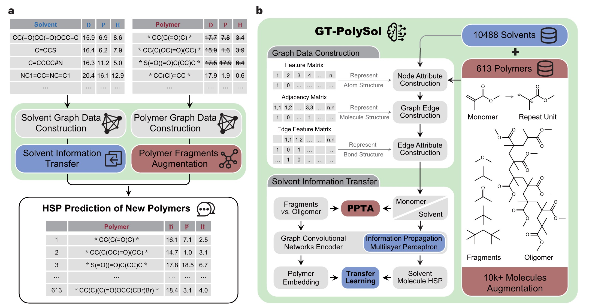

# Transfer learning with graph neural networks to predict polymer solubility parameters

<p align="center"> 

</p>

# Environment Settings 
* python == 3.8
* Pytorch == 1.1.0  
* Numpy == 1.16.2  
* SciPy == 1.3.1  
* Networkx == 2.4  
* scikit-learn == 0.21.3  

# Instructions
Run test1.py to get the results of the case study, which are provided by the trained model.
````
test1.py
````
|smiles |        D     |   P    |    H   |
 |    :----:   |     :----:   |    :----:   |     :----:   |
|S1C=CC=C1C1C2N=CC(OCC(CCCCCC)CCCCCCCC)=NC2C=C(F)C=1F| 19.191254| 1.841487| 3.773237|
|S1C=CC=C1C1C2N=CC(OCCOCCOCCOCCOCCOCCOC)=NC2C=C(F)C=1F |18.555079 |4.038325 |5.875641|
|S1C=CC=C1C1C2N=CC(OC(COCCOCCOCCOC)COCCOCCOCCOC)=NC2C=C(F)C=1F |19.391996| 9.274973| 7.126017|
|S1C=CC=C1C1C2N=CC(OCC(COCCOCCOCCOC)COCCOCCOCCOC)=NC2C=C(F)C=1F| 19.610891 |9.596478| 7.080890|
|S1C=C2C(F)=C(C(OCC(CC)CCCC)=O)SC2=C1C1SC2C(C3SC(CC(CCCC)CC)=CC=3)=C3C=CSC3=C(C3SC(CC(CCCC)CC)=CC=3)C=2C=1| 18.692255| 3.392905| 4.420362|
|C(C1=CC(F)=C(CC(CC)CCCC)S1)1=C2C=CSC2=C(C2=CC(F)=C(CC(CCCC)CC)S2)C2C=C(C3=CC=C(C4SC(C5=CC=CS5)=C5C(=O)C6=C(C(CCCC)CC)SC(CC(CCCC)CC)=C6C(=O)C=45)S3)SC1=2| 18.316938| 2.740952| 4.186481|
